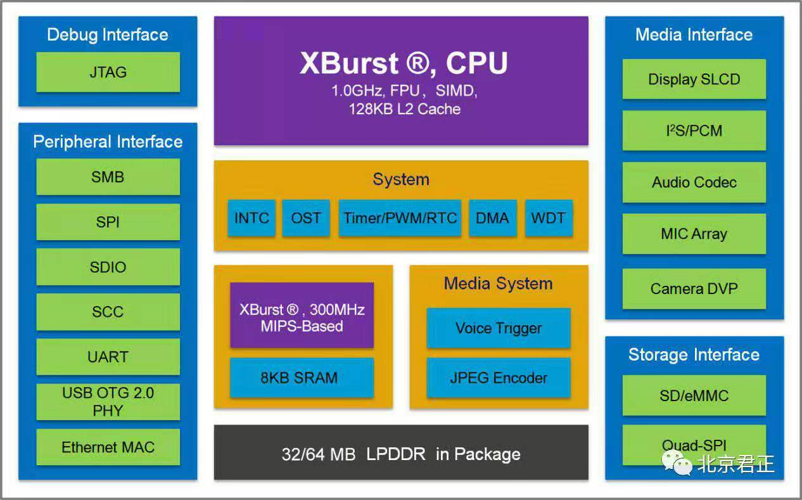
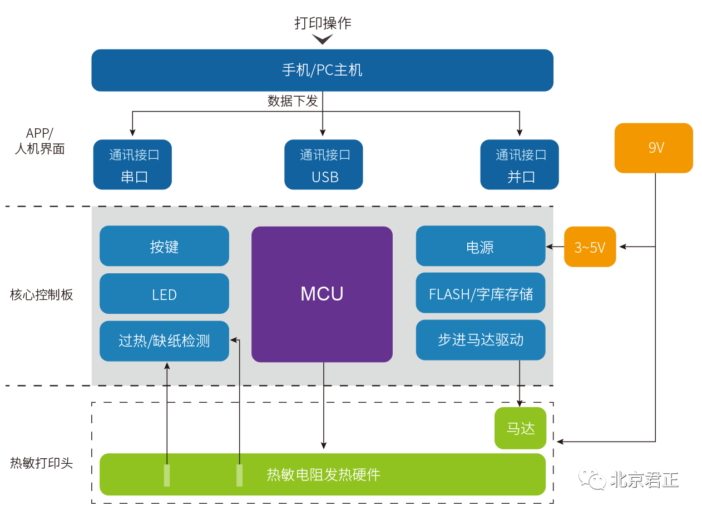
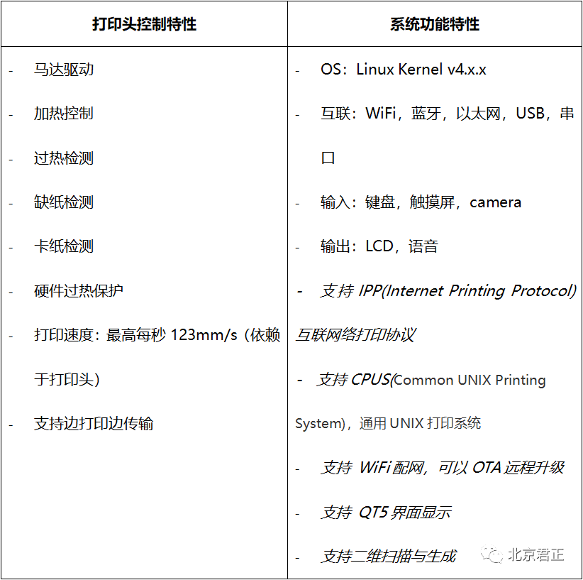
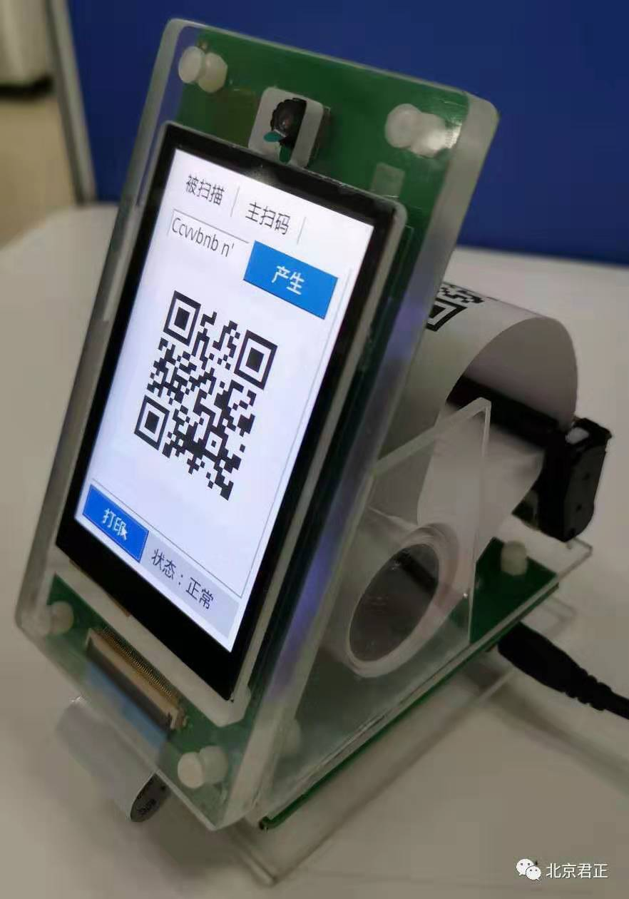
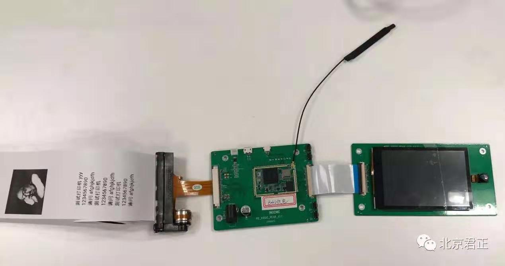

# 君正打印机方案

[君正推出全新云热敏打印方案](https://mp.weixin.qq.com/s?__biz=MzA4MDEwNDgyNg==&mid=2654237511&idx=1&sn=947cd7ca1442914b00c3a79a0b15f0b2&chksm=84698f52b31e0644e38c32b69a6bdf3c44fb8f83bd5b425c4bbb6a768e700b7850663e4d1a40&mpshare=1&scene=1&srcid=&sharer_sharetime=1573004558698&sharer_shareid=9443d101a885c97dc95289b8414f7831&pass_ticket=Sx1NCMs4AIzhSZFQbVGxJULWMiF%2FQhqLOe3FpV4YGQd24YM4wkb%2FGgrTuaT7QD72#rd)

随着万物相连的物联网时代到来，传统的热敏打印机在走向云化，以满足移动化、智能化和精细化“三化”需求。在物联网领域深耕多年的君正，瞄准这一商机，开发了全新单芯片解决方案。

君正推出的云打印单芯片解决方案基于自主MIPS架构的32位高性能低功耗主控芯片X1000，具备高性能、高集成度，集成 32MB/64MB 内存，内置的大小核分工明确，大核达到1GHz 主频，支持Linux和RTOS操作系统，负责解码、交互、联网和丰富的应用功能等，启动时间低至0.6s；小核实时控制打印头，频率达300MHz。更重要的是X1000核是基于MIPS自主研发的，可实现低至0.09mW/MHz的低功耗。

**X1000芯片特性如下：**

* 高性能
1GHz主频，
启动时间低至0.6s
* 高集成度
集成32MB/64MB内存
大小核，内置MCU,可实时控制打印头
集成LCD、CIM、以太网接口
* 低功耗
0.09mW/MHz
* 低成本
单芯片解决方案

君正云打印解决方案的推出意义重大。传统热敏打印机主要由APP/人机界面、核心控制板和热敏打印头组成，核心控制板中MCU的作用最为重要，以实现打印控制、数据交互、系统控制等。如果从传统方案升级为云化，传统MCU一般只有几十兆的频率，难以实现联网、人机交互、控制等多元化功能。联网则需扩展更多的模块，意味着增加额外的MCU，因接口较少，各个模块之间互联对整合和调试带来了额外的难度。同时运行不了标准的操作系统，智能化难以实现。

而通过X1000 新型打印方案，君正为热敏打印业带来了全新优势，手机和电脑无需安装驱动程序，直接联直接打。同时在方案的硬件设计上结构简单，性价比高。

* 君正云打印解决方案特性列表：

此外，针对市场不同场景应用，君正还提供扩展式解决方案，支持LCD显示、二维码扫描、音频输出、键盘或触摸屏输入以及以太网接入等功能，基于标准的Linux开发接口和丰富的软件资源，客户可快速地完成功能丰富的智能化打印机的开发。以普通餐饮的打印配置举例，一般至少需要几个打印机和二维码扫描盒，而通过君正的这一方案即可外接一个显示屏加摄像头就可直接完成相应工作，简化配置，移动灵活。

从目前打印市场来看，一般采用的方案大都是通用MCU，没有专门针对云打印市场进行优化和迭代，而且专用的SoC方案还十分鲜见。君正率先垂范，通过硬件整合、软件调试，拿出了软硬件一体化基本方案和扩展方案，成为了云打印市场的先行军。

