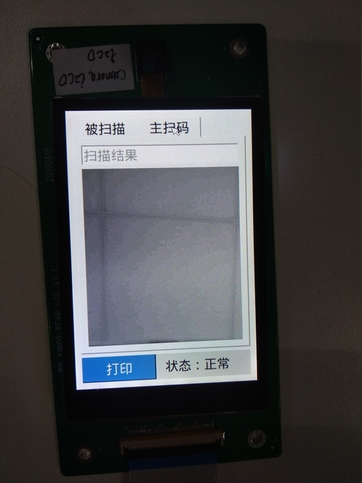

# Ingenic printer快速上手指南

## 代码结构
本工程分为如下几个目录，各目录存放内容如下：

+ build : 整个工程的编译规则
+ buildroot : buildroot源码，提供基础文件系统
+ device : 板级配置信息
+ external : 只读文件系统和程序异常调试信息
+ hardware : kernel、uboot编译和wifi firmware安装
+ package : 存放buildroot之外打印机系统需要的相关模块
+ prebuilts : 存放烧录工具、编译链
+ kernel : kernel源码
+ u-boot : uboot源码

## 如何编译
* 设置环境变量

```
source build/envsetup.sh
```
* 选择device

目前有两个device，j618_usb-userdebug是halley2平台打印机，kunpeng_usb-userdebug是pear平台热敏打印机，可通过执行以下命令进行选择：

```
lunch
```
* 编译和image
以j618_usb-userdebug为例，编译整个工程方法如下：

	+ 在工程目录下执行make或make MAKE_JLEVEL=8或make -j8（多线程编译）,编译完成后在out/product/j618/image目录下生成kernel，kernel-recovery，system.ubifs，u-boot-with-spl.bin镜像。
	+ 在工程目录下执行make ota_mkpackage，编译完成后在out/product/j618/image目录下ota目录和zero文件，其中ota目录是升级包。

* 模块单独编译
在工程目录下重新编译uboot,kernel,kernel-recovery,buildroot和整个system，命令如下：

	+ uboot : make u-boot-clean;make u-boot
	+ kernel : make kernel-clean;make kernel
	+ kernel-recovery : make kernel-recovery-clean;make kernel-recovery
	+ buildroot : make rootfs-clean;make rootfs
	+ system : make rootfs-clean;make rootfs;rm -r out/product/j618/obj/post-intermediate;make

## 如何烧录

* [How_to_Burn.html](../USBClone_Guide/How_to_Burn.html)

## 如何使用
### 启动与串口打印
halley2开发板，通过usb线供电，通过usb接受串口信息，波特率为115200。

### 蓝牙配网
本工程提供蓝牙ble协议配网功能，系统开机自动启动ble server，接收手机端网络配置数据进行配网。

* 配网首先在Android手机上安装packages/kunpeng/network/bluetooth/android_phone/apk/app-debug.apk。

* 打开蓝牙、wifi

* 启动应用BLE Demo

* 点击scan按钮搜索设备，如下图。


* 找到printer_4672设备，其中4672是设备mac地址的最后四个数字，点击进入，如下图，图中红框位置显示当前设备网络状态(ap/sta)，输入ssid和passwd，点击send，进行配网。


* 配网成功后红框位置会更新网络状态，如下图。


* 如果需要切换到ap模式，点击ap按钮，切换成功后，红框位置会显示ap mode。

更多关于网络配置信息，请阅读：

* [Network_Manager.html](../Network_Manager/Network_Manager.html)

### 热敏打印机测试项

本工程选择kunpeng_usb-userdebug平台即可编译热敏打印机方案，该方案提供如下功能：

+ 被扫描：设备通过链接生成二维码，供手机扫描。
+ 主扫描：设备通过camera扫描二维码，识别二维码得到对应的链接地址。
+ 打印：被扫描时，设备打印生成的二维码，主扫描时，设备打印识别的二维码链接地址。
+ 打印机状态实时更新：包括缺纸、卡纸、过温。

测试方法如下：
开机启动后，设备默认会显示被扫描界面，如下图：


界面下方会显示打印机状态信息，正常表示可以打印，如果出现缺纸、卡纸、或过温状态，设备会停止打印。在输入框输入链接地址，点击“产生”按钮，即可产生二维码，如下图：


此时点击“打印”按钮，可将产生的二维码打印出来。
点击主扫描，可以看到camera实时数据，如下图：



将二维码放到camera上进行扫描，扫描成功，在编辑框中显示出二维码对应的链接地址，如下图。


此时点击“打印”按钮，可以将产生的链接地址打印出来。

