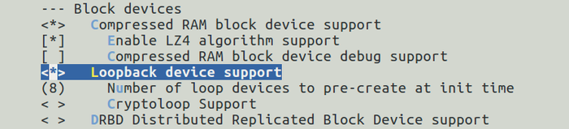
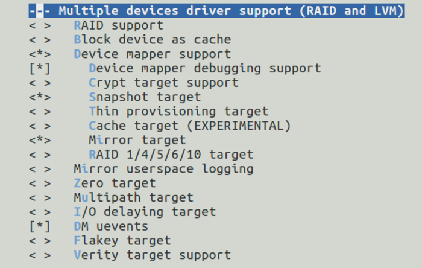
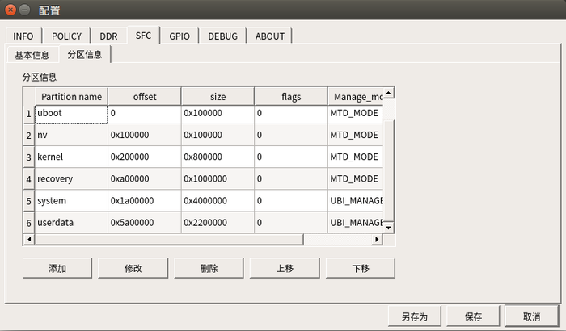

# readonlyfs 只读文件系统制作

## 实现原理
本方案推荐利用Device mapper机制的snapshot功能实现只读文件系统，防止文件系统被破坏。具体原理如下：

通过一个简单的文件系统，利用Device mapper机制将只读的文件系统镜像rootfs.ext2和一个可读写的文件data.img结合起来，在/dev/mapping目录下生成一个逻辑根文件设备，挂载这个逻辑根文件设备，chroot到这个目录下，就可以得到一个可读写的根文件系统。在这个根文件系统中所有的写操作会直接写入data.img中，当我们读取根文件系统时，如果读取的内容没有变化，将直接从rootfs.ext2中读取，如果读取的内容被更新过，将从data.img中读取。如果data.img被写满，根文件系统的读写操作将会出错，因此必须给data.img设置一个合理的大小以防止被写满。
具体参考[example](https://www.cnblogs.com/pengdonglin137/p/3521408.html) 

## 实现方法
* 制作一个简单的文件系统（第一级文件系统，参见external/readonlyfs/rootfs目录），将buildroot生成的rootfs.ext2放到该文件系统中，打包生成镜像。将该镜像烧录到nand中，以只读方式挂载。
* 系统启动后将/usr/data目录以读写方式挂载到userdata分区，具体参见external/readonlyfs/rootfs/etc/init.d/S21mount文件。
* 在/usr/data目录下创建data.img文件，将buildroot生成的rootfs.ext2和/usr/data/data.img结合成一个逻辑根文件设备并挂载，具体参见external/readonlyfs/rootfs/etc/init.d/S31write文件。
* chroot到最终生成的可读写文件系统（第二级文件系统）。

## 环境搭建
下面的环境配置我们都已经在工程中设置好了，如果需要定制自己板级，制作只读文件系统需要做如下操作：

* uboot

将文件系统挂载改为只读

* kernel

`make menuconfig`选择Device Drivers=> Block devices=> Loopback device support

选择Device Drivers=> Multiple devices driver support (RAID and LVM)

* buildroot

保证编译出的文件系统中有fsck.ext4,ubiattach,ubidetach,ubimkvol,flash_erase这些命令。

* 生成只读文件系统

编译完buildroot后，执行external/external/readonlyfs/mkrootfs.sh脚本，更新out/product/j618/image/目录下的system.ubifs文件，system.ubifs就是做好的只读文件系统。

## 恢复出厂设置
由于data.img记录文件系统的所有改变，因此只需删除data.img文件即可实现恢复出厂设置。本方案会记录重启次数，如果连续4次重启不成功，就恢复出厂设置。

## ota升级处理
本方案针对文件系统ota升级做了处理，在每次编译时会记录rootfs.ext2的md5值到rootfs.ext2.md5中，将rootfs.ext2和rootfs.ext2.md5一起拷贝到第一级文件系统中，第一级系统启动后将其拷贝到/usr/data/rootfs.md5，如果系统升级，系统中的rootfs.ext2.md5和/usr/data/rootfs.md5会不相等，此时删除data.img恢复出厂设置，把新的md5记录到/usr/data/rootfs.md5中。因此在buildroot ota升级时，只需将最终生成的out/product/j618/image/system.ubifs制作成升级包放到服务器上即可。

## 注意事项
* 向文件系统拷贝的文件不易过大，虽然data.img为10M，但实际不能记录10M的数据文件。
* 只读文件系统制作需要挂载userdata分区，因此烧录工具分区名一定要设置为userdata,如下图：

