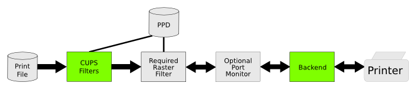

# CUPS打印服务
CUPS(Common UNIX Printing System)，CUPS管理本地打印机并提供IPP网络打印服务。

* 参考文章
CUPS doc(https://www.cups.org/documentation.html)
[](images/cups_doc.png)


## CUPS源码包
基于buildroot集成的CUPS源码包，buildroot版本(_version: 2018.11.x_)

其中CUPS version:

 * cups-2.2.7/
 * cups-filters-1.21.3/
 * avahi-0.7/                   (DNS网络服务)


## CUPS安装文件
CUPS安装后主要有3个目录

>
 /etc/cups/
 /usr/lib/cups/
 /usr/share/cups/

其中：
>
filter:  /usr/lib/cups/filter/
backend: /usr/lib/cups/backend/
drv: /usr/share/cups/drv/

细节请查看： [CUPS文件列表](cups_files.md)


## CUPS常用命令

配置文件：/etc/cups/cupsd.conf
```
LogLevel debug

# Only listen for connections from the local machine.
#Listen localhost:631
# Allow remote access
Port 631


log文件：
/var/log/cups/error_log 
 /var/log/messages 
 
```

CUPS常用命令
```shell
添加网络打印机：
lpadmin -p 143 -E -v dnssd://HP_1110%20%40%20sw1-Rev-1-0._ipp._tcp.local/cups?uuid=b192e55f-94fd-334a-667d-d47ed3c4e920


 打印文档：
# lp -d 143 printers.conf
request id is 143-2 (1 file(s))
# 

$ lpinfo -v
network ipp14
network lpd
network https
serial serial:/dev/ttyUSB0?baud=230400
network socket
direct hp
network ipp
network http
network ipps
network smb
direct hpfax
network dnssd://143%20%40%20printer._ipp._tcp.local/cups
network dnssd://HP%20DeskJet%201110%20series%20%40%20ubuntu-18._ipp._tcp.local/cups
network dnssd://HP_1110%20%40%20printer._ipp._tcp.local/cups
network dnssd://halley2%20%40%20printer._ipp._tcp.local/cups
network dnssd://ubuntu18%20%40%20printer._ipp._tcp.local/cups


查看驱动文件：
# lpinfo -m
drv:///sample.drv/dymo.ppd Dymo Label Printer
everywhere IPP Everywhere

usb打印机示例
# /usr/lib/cups/backend/usb 
DEBUG: Loading USB quirks from "/usr/share/cups/usb".
DEBUG: Loaded 88 quirks.
DEBUG: list_devices
DEBUG: libusb_get_device_list=2
DEBUG2: Printer found with device ID: MFG:HP;MDL:DeskJet 1110 series;CMD:PCL3GUI,PJL,Automatic,DW-PCL,DESKJET,DYN;CLS:PRINTER;DES:K7B87D;CID:HP
Deskjet_P976D;LEDMDIS:USB#07#01#02,USB#FF#04#01;SN:CN88O28409065W;S:038000C480a00001002c240003cc140003c;Z:05000009000009,12000,17000000000000,1
81; Device URI: usb://HP/DeskJet%201110%20series?serial=CN88O28409065W
direct usb://HP/DeskJet%201110%20series?serial=CN88O28409065W "HP DeskJet 1110 series" "HP DeskJet 1110 series" "MFG:HP;MDL:DeskJet 1110 series
;CMD:PCL3GUI,PJL,Automatic,DW-PCL,DESKJET,DYN;CLS:PRINTER;DES:K7B87D;CID:HPDeskjet_P976D;LEDMDIS:USB#07#01#02,USB#FF#04#01;SN:CN88O28409065W;S:
038000C480a00001002c240003cc140003c;Z:05000009000009,12000,17000000000000,181;" ""
# 


```


## CUPS添加自定义打印机
常见打印机接口为USB/Serial/Parallel。本例添加自定义SPI接口打印机。

>   # lpadmin -p spi -E -v spi:///deskjet -m drv:///spi.drv/spi.ppd
执行后生成打印机配置：
/etc/cups/ppd/spi.ppd 

 
* 自定义backend：/usr/lib/cups/backend/spi
* 增加自定义驱动：/usr/share/cups/drv/spi.drv

### 自定义backend: spi
自定义spi backend源代码： _"packages/kunpeng/cups_backend_raster/backend/spi/"_
backend示例： cups-filters-1.21.3/backend/serial.c

>打印测试页：
/usr/lib/cups/backend/spi job-id user title 1 options /spi/testpage/TestPage.prn


### 自定义spi.drv
其中spi.drv参考自 _"/usr/share/cups/examples/minimum.drv"_
```
// Include standard font and media definitions
#include <font.defs>
#include <media.defs>

// List the fonts that are supported, in this case all standard
// fonts...
Font *

// Manufacturer, model name, and version
Manufacturer "Ingenic"
ModelName "Ingenic J618"
Version 1.0

// Each filter provided by the driver...
Filter application/vnd.cups-raster 100 rastertofoo

// Supported page sizes
*MediaSize Letter
MediaSize A4

// Supported resolutions
*Resolution k 8 0 0 0 "600dpi/600 DPI"

// Specify the name of the PPD file we want to generate...
PCFileName "spi.ppd"

```


## CUPS 系统框架图

------
### CUPS-block-diagram


------
### CUPS-block-diagram: (filter/raster/backend)


------
### filters_backend


