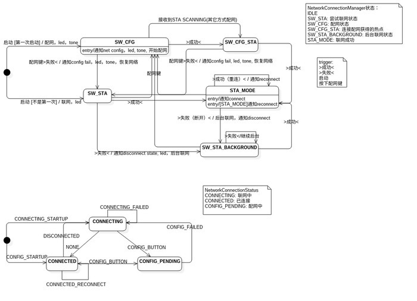

# networkmanager网络管理服务

## network_manager程序
代码位置：packages/kunpeng/network/network-manager-app/network_manager/

### 介绍
network_manager是一个用于设置网路模式，管理网络连接的服务程序，它拥有如下主要功能:

* sta: wifi sta模式，连接wifi热点
	+ 连接热点（指定热点或者使用热点列表中保存的热点）
	+ 监听网络状态：监听连接成功，连接失败（连接超时，找不到热点，密码错误），连接断开，连接重连，ip地址变化等状态
	+ 管理热点列表：所有热点保存到/usr/data/wpa_supplicant.conf，每个热点有自己的优先级，设置连接成功的热点优先级为最高。
	+ 得到当前环境下的所有wifi热点
* ap: wifi ap模式，设备作为一个wifi热点
* net_config：网络配置模式<br>
由于大部分智能设备没有屏幕和键盘等输入输出设备，这样设备如何连接WiFi热点就成了很大问题。我们整合了几种网络配置方法：
	+ arikiss: 微信提供的网络配置方法。wifi进入混杂模式，通过抓取某种协议包进行网络配置。配合手机微信客户端操作，操作简单，但兼容性不够好。具体可以参考微信硬件平台。
	+ cooee: 博通提供的wifi配网，和airkiss原理类似，速度比airkiss快，但同样有兼容性问题。
	+ simple_config: realtek wifi配网，和cooee相似。(此版本只支持realtek8723bs )
	+ WiFi WPS配网
	+ AP配网: 设备先作为热点接收网络配置信息，再连接网络。操作复杂，时间长，但可靠性好。（需要和network_apconfig配合使用）。

network_apconfig是一个ap配网程序，设备作为ap热点接收wifi ssid和密码，再进行联网。
NetworkManagerDemo中展示了它如何和network_manager配合使用。

### 依赖的第三方应用程序和库
需要提供下面的程序和库才能编译通过并正常使用：

* wpa_supplicant
* wpa_cli
* hostapd
* dnsmasq
* libwpa.so
* librt.so
* libcrypto.so
* libpthread.so

### 编译方法
* 单独编译

```
cd packages/kunpeng/network
mm
```

* 生成文件

	+ S45network.sh：启动脚本，开机启动network_manager
	+ libwifi.so和wifi_interface.h：接口库和接口头文件（下面会详细介绍）
	+ network_manager,startap.sh,startsta.sh,libbroadcom_api.so：network_manager可执行程序和依赖的库和脚本。

先启动network_manager，再通过libwifi.so提供的接口操作服务。

### API接口
#### 注册
* 函数原型
```
int register_to_networkmanager(int (*message_callback)(const char *message));
```

* 描述

当前进程注册到network_manager，当前版本一个进程只能注册一次。

`message_callback`用来接受network_manager message，message是一个json格式的字符串，通过解析字符串就可以得知网络的状态。字符串代表的具体含义后面会有详细介绍。

* 参考代码

```
    if (register_to_networkmanager(callback)) {
        pr_err("Failed to register network_manager\n");
        return nullptr;
    }
```

#### 注销
* 函数原型
```
int unregister_from_networkmanager(void);
```

* 描述

注销当前进程

* 参考代码

```
	if (unregister_from_networkmanager()) {
		pr_err("unregister failed\n");
	}
```

#### 切换模式
* 函数原型
```
int request_wifi_mode(wifi_ctl_msg_t msg);
```

* 参数

```
typedef struct wifi_ctl_msg_s {
	char ifname[16];
	wifi_cmd_t cmd;
	union {
		struct switch_station_cmd_param switch_sta;
		struct switch_softap_cmd_param switch_ap;
		struct net_config_param network_config;
		char hostname[64];
	} param;
	pid_t pid;
	char name[32];
} wifi_ctl_msg_t;

typedef enum wifi_cmd {
	GET_CUR_MODE,
	SW_AP,
	SW_STA,
	SW_STA_NEXT_NET,
	SW_NETCFG,
	STOP_WIFI,
	STOP_ALL_WIFI,
	SET_STA_HOSTNAME,
	STARTUP_ETHERNET,
	STOP_ETHERNET,
} wifi_cmd_t;
```

* 描述

给network_manager发送命令，切换到相应模式。成功返回0。

* 参数说明
	+ ifname：wifi device interface name, 比如wlan0, wlan1
	+ cmd:
		+ GET_CUR_MODE：检查当前模式
		+ SW_AP：切换到AP模式
		+ SW_STA：切换到STA模式
		+ SW_STA_NEXT_NET：尝试连接sta热点列表中下一个热点
		+ SW_NETCFG：切换到配网模式
		+ STOP_WIFI：停止ifname device
		+ STOP_ALL_WIFI: 停止所有device
		+ SET_STA_HOSTNAME: 设置hostname

#### STA Mode
##### SW_STA命令
* 描述

切换到STA模式

* sta参数
```
struct switch_station_cmd_param {
	char ssid[64];
	char psk[128];
	char bssid[17];
	int connect_timeout;
	int ip_timeout;
};
```

* sta参数说明：
	+ ssid: 需要连接的热点名，如果为空，则连接保存的热点列表的第一个。
	+ psk: 需要连接的热点密码。
	+ bssid：无效
	+ connect_timeout：sta连接超时时间，单位是秒，默认60s。
	+ ip_timeout：获取ip的超时时间，单位是秒，默认20s。

* 参考代码：

```
bool NetworkManagerWrapper::switchNextStaMode(int timeout) {
    wifi_ctl_msg_t mode = {0};

    mode.cmd = SW_NEXT_NET;
    mode.param.switch_sta.connect_timeout = timeout;
    if (request_wifi_mode(mode))
        return true;
    else
        return false;
}
```

##### SW_STA_NEXT_NET命令
* 描述

尝试连接热点列表中保存的下一个热点。通常用于当前热点连接错误的时候，尝试连接下一个热点。

* 参考代码：

```
bool NetworkManagerWrapper::switchNextStaMode(int timeout) {
    wifi_ctl_msg_t mode = {0};

    mode.cmd = SW_STA_NEXT_NET;
    mode.param.switch_sta.connect_timeout = timeout;
    if (request_wifi_mode(mode))
        return true;
    else
        return false;
}
```

##### callback message
STA相关的消息有：

* 开始连接网络
```
{ "name": "wlan0", "type": "STA_STATUS", "content": "STA_CONNECT_STARTING" }
```
* 找不到wifi热点
```
{ "name": "wlan0", "type": "STA_STATUS", "content": "STA_CONNECT_FAILED", "reason": "SCAN_SSID_FAILED" }
```
* 密码长度无效（密码长度不符合加密方式的要求）
```
{ "name": "wlan0", "type": "STA_STATUS", "content": "STA_CONNECT_FAILED", "reason": "INVALID_PWD_LEN" }
```
* 密码认证错误
```
{ "name": "wlan0", "type": "STA_STATUS", "content": "STA_CONNECT_FAILED", "reason": "WRONG_KEY" }
```
* 连接超时
```
{ "name": "wlan0", "type": "STA_STATUS", "content": "STA_CONNECT_FAILED", "reason": "CONNECT_TIMEOUT" }
```
* 保存的热点列表扫描完毕
```
{ "name": "wlan0", "type": "STA_STATUS", "content": "STA_SCAN_OVER" }
```
* 获取ip地址超时
```
{ "name": "wlan0", "type": "STA_STATUS", "content": "STA_CONNECT_FAILED", "reason": "GET_IP_TIMEOUT" }
```
* STA连接成功
```
{ "name": "wlan0", "type": "WIFI_MODE", "content": "STA", "last": "WIFI_NULL" }
```
通常的使用逻辑是设备发送SW_STA尝试连接热点，发现热点连接错误，就发送SW_NEXT_NET尝试下个热点，直到连接成功或者STA_SCAN_OVER。

* STA ip地址改变
```
{ "name": "wlan0", "type": "IP_CHANGE", "content": "xxx.xxx.xxx.xxx" }
```
ip地址改变时，要重启通过ip地址进行局域网传输的服务。（比如dlna）

##### 热点列表
程序会把连接成功的热点保存到/usr/data/wpa_supplicant.conf，network_manager启动时会读取这个文件，获得保存的热点列表。客户端可以通过发送一个没有ssid的SW_STA命令，连接保存的热点。

#### AP Mode
##### SW_AP
* 描述

切换到AP模式

* 参数

```
typedef struct switch_softap_cmd_param {
	char ssid[64];
	char psk[128];
	char bssid[17];
	char ipaddr[16];
} softap_t;

```

* 参数说明：
	+ ssid: 需要创建的热点名
	+ psk: 需要创建的热点密码
	+ bssid：无效
	+ ipaddr: 本机的ip地址和网关（比如192.168.1.1）

* 参考代码：

```
bool NetworkManagerWrapper::switchNextStaMode(int timeout) {
    wifi_ctl_msg_t mode = {0};

    mode.cmd = SW_AP;
    if (request_wifi_mode(mode))
        return true;
    else
        return false;
}
```

##### callback message
AP相关的消息有：

* AP创建成功
```
{ "name": "wlan0", "type": "WIFI_MODE", "content": "AP", "last": "WIFI_NULL" }
```
* 有设备连接
```
{ "name": "wlan0", "type": "AP_STATUS", "content": "AP-STA-CONNECTED" }
```
* 有设备断开
```
{ "name": "wlan0", "type": "AP_STATUS", "content": "AP-STA-DISCONNECTED" }
```

#### NET Config Mode
##### SW_NETCFG
* 描述

切换到NET CONFIG模式

* 参数

```
struct net_config_param {
	enum net_vendor vendor;
	int method_maps;
	int timeout_ms;
	int channel_holding_time_ms;
	union {
		struct airkiss_info airkiss_info;
		struct cooee_info cooee_info;
		struct cooee_softap_info cooee_softap_info;
		struct simple_config_info simple_config_info;
		struct atalk_info atalk_info;
		struct jdjoy_info jdjoy_info;
	} param;
};
```

* 参数说明:
	+ vendor：wifi芯片厂商，支持NET_VENDOR_BROADCOM和NET_VENDOR_REALTEK
	+ metho_map：配网方式，每一个bit代表一种方式，支持几种方式组合。支持AIRKISS，COOEE，SIMPLE_CONFIG，WPS等
	+ timeout_ms：配网超时时间
	+ channel_holding_time_ms：channel保持时间
	+ 其它参数：不同配网方式需要的参数

* 参考代码：

```
bool NetworkManagerWrapper::switchConfigMode(Vendor vendor, ConfigMethod methods, int timeout) {
    wifi_ctl_msg_t mode = {0};

    mode.cmd = SW_NETCFG;
    mode.param.network_config.timeout_ms = timeout * 1000;
    if ((methods & ConfigMethod::COOEE) != ConfigMethod::NONE)
        mode.param.network_config.method_maps |= NET_CONFIG_METHOD_COOEE;
    else if ((methods & ConfigMethod::SIMPLE_CONFIG) != ConfigMethod::NONE)
        mode.param.network_config.method_maps |= NET_CONFIG_METHOD_SIMPLE_CONFIG;

    if (vendor == Vendor::BROADCOM)
        mode.param.network_config.vendor = NET_VENDOR_BROADCOM;
    else if (vendor == Vendor::REALTEK)
        mode.param.network_config.vendor = NET_VENDOR_REALTEK;

    if (mode.param.network_config.method_maps && request_wifi_mode(mode))
        return true;
    else
        return false;
}
```

##### callback message
NET Config相关的消息有：

* 配网开始
```
{ "name": "wlan0", "type": "NETWORK_CONFIGURE", "content": "NET_CFG_STARTING" }
```
* 配网成功
```
{ "name": "wlan0", "type": "NETWORK_CONFIGURE", "content": "NET_CFG_SUCCESS" }
```
* 配网失败
```
{ "name": "wlan0", "type": "NETWORK_CONFIGURE", "content": "NET_CFG_FAILED","reason":"INVALID_PWD_LEN" } (配网得到的密码长度错误)
{ "name": "wlan0", "type": "NETWORK_CONFIGURE", "content": "NET_CFG_FAILED","reason":"CONFIGURE_TIMEOUT" } (配网超时)
```
* 配网取消
```
{ "name": "wlan0", "type": "NETWORK_CONFIGURE", "content": "NET_CFG_CANCEL" }
```

#### WIFI_NULL Mode
##### STOP_WIFI
* 描述

退出所有网络模式。

* 参考代码：

```
bool NetworkManagerWrapper::stopNetwork() {
    wifi_ctl_msg_t mode = {0};

    mode.cmd = STOP_WIFI;
    if (request_wifi_mode(mode))
        return true;
    else
        return false;
}
```

### 单元测试

代码位置：packages/kunpeng/network/network-manager-app/network_manager/unity_test

## NetworkConnectionManager库和Demo
代码位置：packages/kunpeng/network/network-manager-app/NetworkConnectionManager/

### 介绍
NetworkConnectionManager目录展示了客户端如何使用network_manager，也提供了一套客户端的业务层逻辑，如果这套业务逻辑正好服务需求，可以直接使用生成的libNetworkConnectionManager.so。如果不满足，也可以作为参考代码。

同时，在demo目录下有两个demo程序NetworkConnectionManagerDemo和NetworkManagerDemo，可以用于单独演示。

### NetworkManagerDemo
```
/ # NetworkManagerDemo
+----------------------------------------------------------------------------+
|                       NetworkManagerDemo:                                  |
|                                                                            |
| Press '1' followed by Enter to Switch STA MODE                             |
| Press '2' followed by Enter to Switch Next SSID STA MODE                   |
| Press '3' followed by Enter to Switch STA MODE ssid passwd                 |
| Press '4' followed by Enter to Switch Extern Network Config                |
| Press '5' followed by Enter to Switch BROADCOM COOEE                       |
| Press '6' followed by Enter to Switch REALTEK SIMPLE_CONFIG                |
| Press 's' followed by Enter to Stop Network                                |
| Press 'q' followed by Enter to Quit                                        |
+----------------------------------------------------------------------------+
```
客户端操作network_manager的简单封装，程序接收串口输入，执行相应操作：

* 1：尝试连接保存的热点
* 2：尝试连接串口输入的热点
* 4：尝试EXTERN NETCONFIG方式（AP）
* 5：尝试BROADCOM COOEE配网（43438a0/a1）
* 6：尝试REALTEK SIMPLE_CONFIG配网（rtl8723bs）
* s：停止网络
* q：退出应用程序

#### 可扩展配网方式（EXTERN NETCONFIG ）
network_manager本身没有实现ap配网的逻辑，但是它可以和第三方配网程序配合使用。

这里的例子就是network_apconfig进程，代码在buildroot/ingenic/audio-device-common/utils/network-apconfig-app。

具体的配合方法：

NetworkManagerDemo作为网络管理主程序，network_apconfig作为配网程序。两个应用都要注册到network_manager中。

当设备要配网时，NetworkManagerDemo先发送STOP_WIFI退出所有网络模式，再启动network_apconfig。

network_apconfig启动后发送SW_AP切换到ap模式，接收到手机传过来的ssid和psk，发送SW_STA进行联网。

此时NetworkManagerDemo接收到开始连接网络的事件，得知配网成功，接管network_manager的控制权。

NetworkManagerDemo还维护了一个定时器，如果一定时间内没有收到联网事件，则认为配网超时，关闭network_apconfig，接管network_manager的控制权。

按照这种方法，客户可以扩展任意的配网方式。

具体的实现请参考代码。

### libNetworkConnectionManager.so
libNetworkConnectionManager.so不再是对network_manager操作的简单封装，它提供了一套相对完整的网络管理的业务逻辑。

整个业务的状态机如下：

上面是内部状态机，下面的是外部observer观察到的状态机。

#### 业务逻辑
* 内部状态机代表网络处于那个状态（代码中的m_state）：
	+ SW_STA：程序主动连接网络状态。（分为系统开机，配网失败时恢复网络这两种情况）（From: Initial, SW_CFG, SW_CFG_STA）
	+ SW_CFG：配网状态。（分为开机自动配网和配网键配网）
	+ SW_CFG_STA：配网收到SSID和PSK后，尝试连接网络的状态。
	+ SW_STA_BACKGROUND：后台联网状态，SW_STA失败或者网络自动断开后，设备处于后台持续联网状态。
	+ STA_MODE：联网成功状态。

* 引起状态切换的事件有：
	+ 启动
	+ 成功
	+ 失败
	+ 按下配网键

* 状态迁移图的含义：
	+ 系统启动，发现第一次启动（未配过网），进入SW_CFG状态，开始配网。
	+ 系统启动，发现不是第一次启动，进入SW_STA状态，开始恢复联网。
	+ SW_CFG状态成功，收到ssid和密码，进入SW_CFG_STA状态，开始联网。
	+ SW_CFG_STA状态成功，进入STA_MODE状态，联网成功。
	+ STA_MODE状态成功（STA_MODE状态下又进入了STA_MODE状态），说明网络发生过重连。
	+ STA_MODE失败，网络断开，进入SW_STA_BACKGROUND状态，设备进入后台联网状态。设备会尝试连接所有保存的热点，直到成功。
	+ SW_STA_BACKGROUND成功，回到STA_MODE状态。
	+ 所有状态收到“按下配网键”事件，进入SW_CFG状态，开始配网。除非是SW_CFG和SW_CFG_STA状态，这个状态会退出配网模式，进入SW_STA状态，恢复联网。


#### 外部事件
其它模块如果想检测网络状态，可以继承NetworkConnectionStatusObserverInterface，并调用networkConnectionManager的addObserver方法，把自己添加到networkConnectionManager的观察者列表。这样networkConnectionManager的addObserver状态变化的时候就会通知这个模块。需要注意的是通知是同步的，不要做过长时间的操作，否则会造成networkConnectionManager阻塞。

>[ tips] NetworkConnectionManager是一个单例，在多个地方多次创建拿到的是同一个实例，可以避免代码使用上的一些限制。不过单例中没有加锁，建议启动时就创建出来。

* Status：
	+ CONNECTING：网络连接中
	+ CONNECTED：网络连接成功
	+ CONFIG_PENDING：网络配置中

* event：
	+ CONNECTING_STARTUP：设备启动，自动连接网络
	+ CONNECTING_FAILED：网络连接失败
	+ DISCONNECTED：网络断开
	+ CONFIG_STARTUP：设备启动，自动配置网络
	+ CONFIG_BUTTON：按键配网
	+ CONFIG_FAILED：配网失败
	+ CONNECTED_RECONNECT：网络自动重连

具体逻辑可以参考代码，
程序的类图，业务逻辑的详细描述可以参考networkConnectionManager的doc目录（NetworkConnectionManager.mdj用StarUML打开）。

### NetworkConnectionManagerDemo
```
 NetworkConnectionManagerDemo
rm /usr/datat/wpa_supplicant.conf? (y/N)n
+----------------------------------------------------------------------------+
|                 NetworConnectionkManagerDemo:                              |
|                                                                            |
| Press 'p' followed by Enter to Press Net Config Button                     |
| Press 'q' followed by Enter to Quit                                        |
+----------------------------------------------------------------------------+
```
使用libNetworkConnectionManager.so实现的Demo程序。
