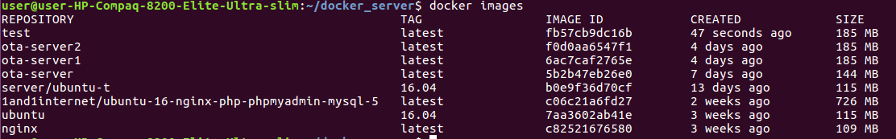
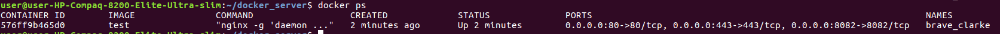
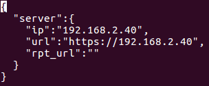
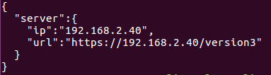

# Ota升级

本方案提供了一整套ota升级方法，具体实现在packages/kunpeng/updater目录。其中libupdater目录实现了一种升级检测的本地策略，和一些升级相关的基础函数。recovery目录是升级程序。ota_package_maker目录用于制作升级包。default_ota_res目录存放升级需要的配置文件、秘钥、提示音文件等。docker_server目录用于搭建服务器。

## 升级策略

本方案提供了一种本地升级策略，是否升级由音箱本地决定。在服务器端升级包路径下存放VERSION文件，记录升级包的版本，在音箱/usr/data/VERSION文件中记录当前的系统版本。检测升级时，音箱通过/usr/data/ota_res/recovery.conf配置文件中的url得到current_version_full.conf。解析这个文件得到升级包路径，获取升级包版本，与当前系统版本做比较，如果升级包版本大于当前系统版本，则启动升级程序进行升级。升级成功后，更新本地/usr/data/VERSION文件，否则不进行升级。

## 服务器环境搭建
### docker方式搭建服务器

为方便测试，本方案提供了一个通过nginx+python实现的https服务器，该服务器使用docker搭建，具体使用方法如下：

+ 拷贝docker相关文件到服务器（以192.168.2.40为例）
```
scp -r packages/kunpeng/updater/docker_server user@192.168.2.40:/home/user/
```
+ 在运行服务器的主机上安装docker，linux下执行以下命令
```
apt-get install docker
apt install docker.io
```
+ 构建镜像
```
cd /home/user/docker_server
docker build -t test .
```
其中，test是生成image的名字，执行成功后，使用docker images命令可以看到test镜像，如下图：



+ 运行容器
```
export DOCK_SERVER_PATH=/home/user/docker_server
docker run -d -p 8082:8082 -p 443:443 -p 80:80 -v $DOCK_SERVER_PATH/ota:/ota -v $DOCK_SERVER_PATH/nginx/conf.d:/etc/nginx/conf.d -v $DOCK_SERVER_PATH/nginx/nginx.conf:/etc/nginx/nginx.conf -v $DOCK_SERVER_PATH/nginx/ssl:/ssl -v $DOCK_SERVER_PATH/nginx/log:/var/log/nginx -t test
```
其中DOCK_SERVER_PATH设置为docker_server目录存放的绝对路径，此时执行docker ps可以看到当前运行的容器，如下图：



+ 进入运行的容器
```
docker exec -it 576ff9b465d0 /bin/bash
```
其中576ff9b465d0为CONTAINER ID，可通过上面docker ps命令得到。
+ 启动nginx https服务
```
service nginx start
```
此时需要输入openssl生成证书时设置的密码，如果您直接使用docker_server/ssl目录中的文件，密码为123456，您也可以自己生成证书，方法稍后讲解。执行成功后，其他设备就可以通过wget命令得到服务器中的文件了。此时，服务器上的docker_server/ota目录被设置为http服务器的根目录，在其他设备上通过下面命令测试服务器工作是否正常。

```
wget https://192.168.2.40/index.html --no-check-certificate
```
其中，192.168.2.40是运行docker的主机IP地址，要替换为您测试的主机IP地址。

到此位置，服务器环境搭建完成。

### openssl生成证书

支持https，需要添加证书到服务器，生成证书步骤如下：

+ 生成2048bit的RSA私钥文件server.key

```
openssl genrsa -des3 -out server.key 2048
输入两次相同的密码
```

+ 生成CSR证书签名请求文件server.csr

```
openssl req -new -key server.key -out server.csr
输入之前的密码
Country Name (2 letter code) [XX]:CN    [国籍]
State or Province Name (full name) []:beijing [省份]
Locality Name (eg, city) [Default City]:beijing    [城市]
Organization Name (eg, company) [Default Company Ltd]:www.server.com [公司]
Organizational Unit Name (eg, section) []:www.server.com [行业]
Common Name (eg, your name or your server's hostname) []:www.server.com  [自己的域名]
Email Address []:

Please enter the following 'extra' attributes
to be sent with your certificate request
A challenge password []:    [这里不填]
An optional company name []:    [这里不填]
```

+ 写RSA秘钥

```
openssl rsa -in server.key -out server_nopwd.key
输入之前的密码
```

+ 获取私钥

```
openssl x509 -req -days 365 -in server.csr -signkey server_nopwd.key -out server.crt
```

将生成的server.crt server.csr server.key server_nopwd.key拷贝到docker_server/nginx/ssl目录下，保证docker_server/nginx/conf.d/default.conf中server_name和生成crs证书时添的域名相同即可。

## Ota生成新版本

### 升级包路径设置
+ 修改packages/kunpeng/updater/default_ota_res/recovery.conf文件，将ip改为运行docker的主机IP地址，将url改为current_version_full.conf存放的位置。如果将current_version_full.conf存放在服务器的docker_server/ota目录下，则url设置为https://192.168.2.40。将rpt_url改为上报升级状态的服务器地址，如果没有，设置为空。本例中recovery.conf内容如下图。



+ 修改packages/kunpeng/updater/ota_package_maker/example/config/current_version.conf文件，将ip改为运行docker的主机IP地址，url为升级包存放位置，如果升级包存放在docker_server/ota/version3目录下，则url设置为https://192.168.2.40/version3，将该文件拷贝到服务器端docker_server/ota目录下，改名为current_version_full.conf，本例中current_version_full.conf内容如下图。



### 存放升级包

+ 将编译生成的升级包和current_version.conf拷贝到服务器上

```
scp packages/kunpeng/updater/ota_package_maker/example/config/current_version.conf user@192.168.2.40:/home/user/docker_server/ota/current_version_full.conf
scp -r out/product/j618/image/ota/* user@192.168.2.40:/home/user/docker_server/ota/version3/
```

+ 在服务器升级包路径下创建VERSION文件

```
cd /home/user/docker_server/version3
echo 13 > VERSION
```

## 测试

+ 系统启动后，通过手机进行蓝牙配网，具体参考[Ingenic_Printer_Quick_Start_Guide.html](../Ingenic_Printer_Quick_Start_Guide/Ingenic_Printer_Quick_Start_Guide.html)
+ 执行update，启动升级检测程序，该程序等待30s，会自动进行升级。

## Ota测试常见问题

+ 升级包制作失败，出现如下错误信息：

```
Could not find the main class: com.android.signapk.SignApk. Program will exit.
    adding: update008/ (stored 0%)
    adding: update008/xImage_003 (deflated 0%)
Exception in thread "main" java.lang.UnsupportedClassVersionError: com/android/signapk/SignApk : Unsupported major.minor version 51.0
        at java.lang.ClassLoader.defineClass1(Native Method)
        at java.lang.ClassLoader.defineClassCond(ClassLoader.java:631)
        at java.lang.ClassLoader.defineClass(ClassLoader.java:615)
        at java.security.SecureClassLoader.defineClass(SecureClassLoader.java:141)
```

由于升级包制作程序中有提前编译好的jar包，编译jar包时的java版本和您当前制作升级包的服务器java版本不匹配导致。解决办法，执行如下命令：

```
cd packages/kunpeng/updater/ota_package_maker/otapackage/depmod/signature/signapk
rm -f signapk.jar
./build.sh
cd -
rm out/product/j618/obj/ota/ -rf
rm out/product/j618/image/ota/ -rf
make ota_package
```

这样就会成功制作升级包，制作出的升级包在out/product/j618/obj/ota/目录下，将其拷贝到服务器即可。
