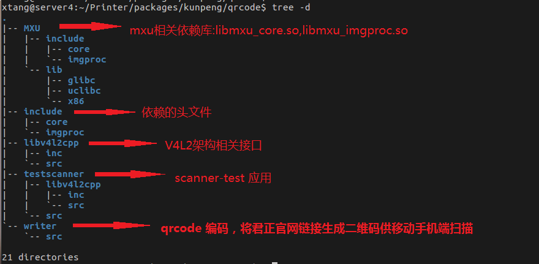
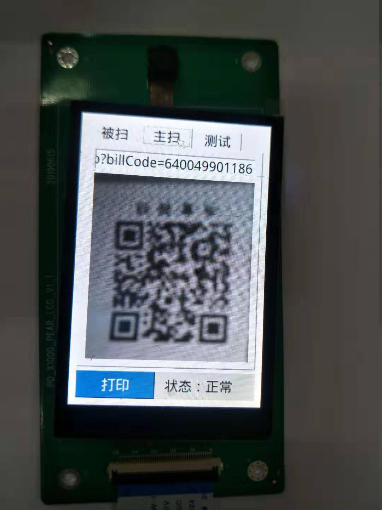
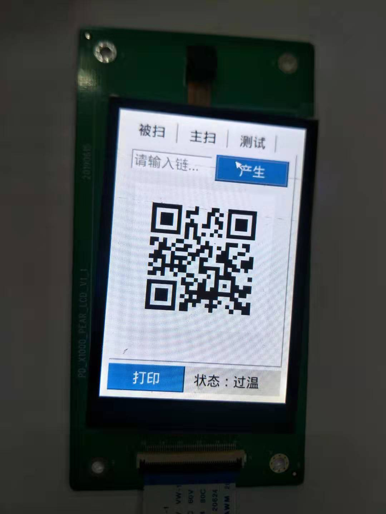

# qrcode二维码识别

##qrcode 简介

&emsp;   &ensp;近年来，随着移动互联网快速的发展，电子商务，物联网等多个热门领域的升温，二维码可以说是无孔不入的渗透进了我们的生活，为我们的生活提供了巨大的便利。那么什么是二维码？二维码有什么优势？  
&emsp;   &ensp;我们所说的QRCode(Quick Response Code)码，是由Denso公司于1994年9月研制的一种矩阵二维码符号，它具有一维条码及其它二维条码所具有的信息容量大、可靠性高、可表示汉字及图象多种文字信息、保密防伪性强等优点。  
&emsp;   &ensp;君正qrcode 通过局部二制化的方式实现了一套完整的二维码编码解码流程，下面会分段介绍君正qrcode 代码结构，主要接口，编译及使用方式。

## 代码路径及结构

* 代码路径： Printer/packages/kunpeng/qrcode
* 代码结构：



* 主要接口：

	君正qrcode 的编码解码相关流程实现集成在了“libqrscanner.so” 库中，此库源码不开源，主要实现接口如下：
	Printer/packages/kunpeng/qrcode/testscanner/src/scanner.h

```C
void*    CreateQrCodeScanner();  /*创建scanner对象*/

int32_t  Decoder(void* scanner,uint8_t *ybuffer,int width,int height,int tryhard); /*qrcode 解码，当前代码支持的输入数据是yuv中提取的y数据*/

int32_t  GetResultString(void *scanner,char *result,int32_t max_size);  /*获取qrcode 解析结果*/

void     DestoryQrCodeScanner(void *scanner);  /*销毁scanner对象*/

int32_t CreateQrCodeBmp(const char*filename,char *text,int32_t size,int32_t margin,int32_t width,int32_t heigth,int32_t ecc);  /*创建qrcode bmp格式文件*/
```
##编译方式

* 整体编译
	在相应的板级配置文件下添加"qrcode"模块名，之后整体编译:
	
	a. 文件:Printer/device/kunpeng/kunpeng_base.mk

```C
  1 #Tools and libraries necessary by program
  2 
  3 #kernel & uboot
  4 PRODUCT_MODULES += kernel \
  5                    kernel-recovery \
  6                    $(UBOOT_TARGET_FILE) \
  7                         systemconfigs \
  8                    fw_43438 \
  9                    network_manager \
 10                    network_utils \              
 11                    event_manager \
 12                    bluetooth \
 13                    recovery \
 14                    libupdater \
 15                    systemserver \
 16                    debugger \
 17                    imgui \
 18                    qtmain \
 19                    qrcode \   #qrcode 模块
 20                    raster \
 21                    zh-fonts \
 22                    jz_printer

```
b. 编译:
	

```	
			# cd Printer
			# source build/envsetup.sh
			# lunch
			<选择要编译的板级：kunpeng_usb-userdebug>
			# make
```
* 单独编译

			# cd Printer
			# make qrcode
			Note:
				如果当前shell 没有初始化过编译环境需要先初始化编译环境之后单独编译。
					# source build/envsetup.sh
					# lunch

* 生成目标
 	
	a.目标路径：

		Printer/out/product/kunpeng/obj/packages/kunpeng/qrcode/qrcode

	b.目标文件：

			<目标路径>/libv4l2cpp/libv4l2wrapper.a
			<目标路径>/testscanner/scanner-test         /*scanner-test:将二维码解析出字符串*/
			<目标路径>/writer/writer      /*writer:将输入字符串生成二维码*/

* 依赖库

			usr/lib/libmxu_core.so
			usr/lib/libmxu_imgproc.so
			usr/lib/libqrscanner.so
			
##qrcode 主要代码解析
* scanner-test 二维码解析

a.文件：Printer/packages/kunpeng/qrcode/testscanner/src/main.cpp
	
```C
int main(int argc, char **argv)
{
302         if(argc < 4){                                                                         
303                 printf("%s camera need_result neet_yuv\n",argv[0]);                           
304                 return -1;                                                                    
305         }                                                                                     
306                                                                                               
307         //int hid_fd;                                                                         
308         //sy_usbhid_init(&hid_fd);                                                            
309                                                                                               
310         int need_result = atoi(argv[2]);//add for qt                                          
311         int need_yuv = atoi(argv[3]);                                                         
312         printf("need_result=%d,need_yuv=%d\n",need_result,need_yuv);                          
				......
				......
				......
366         const size_t bufferSize = WIDTH * HEIGHT * 2;            /*yuv 数据大小，单位bytes*/                                 
367         uint8_t buffer[bufferSize];                                                               
368         uint8_t ybuffer[bufferSize / 2];                              /*yuv 中提取y数据大小，单位bytes*/                          
369         //FbShow show;                                                                            
370                                                                                                   
371         const V4L2DeviceParameters param(argv[1], V4L2_PIX_FMT_YUYV, WIDTH, HEIGHT, 30, 1);     /*v4l2 capture 设备参数：yuv格式数据，width,height,fps,verbose */ 
372         V4l2Capture *c = V4l2Capture::create(param,V4l2Access::IOTYPE_MMAP);     /*使用mmap 接口创建一个 v4l2 capture */                   
373         c->queryFormat();                                                                         
374         timeval timeout,timecnt,timepre;                                                          
375         timeout.tv_sec = 1;                                                                       
376         timeout.tv_usec = 40000;                                                                  
377         int stopped = -1;                                                                         
378                                                                                                   
379         void *qrContext = CreateQrCodeScanner();    /*创建一个scanner对象*/
380         bool res = 0;                                                                                                        
381         static char tmpresult[512];                                                                                          
382         memset(tmpresult,0x0,sizeof(tmpresult));                                                                             
383                                                                                                                              
384         char arg[100]="./pwm_config.sh";                                                                                     
385         int drop_frame = 0;                                                                                                  
386                                                                                                                              
387         do{                                                                                                                  
388                 for(int k=0;k<2;k++){                                                                                        
389                         bool isReadable = (c->isReadable(&timeout) == 1);                                                    
390                         if(isReadable){                                                                                      
391                                 size_t nb = c->read(reinterpret_cast<char*>(buffer), bufferSize);                            
392                                 if(nb){                                                                                      
393                                         if(drop_frame){                                                                      
394                                                 drop_frame--;                                                                
395                                                 continue;                                                                    
396                                         }                                                                                    
397                                                                                                                              
398                                         //printf("--------------------------%d---------------\n",k);                         
399                                         char result[512];                                                                    
400                                         int result_size = strlen(result);                                                    
401                                         //printf("reult_size = %d tmpresult size =%d\n",result_size,strlen(tmpresult));      
402                                         gettimeofday(&timecnt,NULL);                                                         
403                                                                                                                              
404                                         // yuv to y                                                                          
405                                         yuv2y(buffer,ybuffer,WIDTH,HEIGHT);                                                  
406                                                                                                                              
407                                         //add for qt                                                                         
408                                         if(need_yuv) {                                                                       
409                                                 //int a = 0;                                                                 
410                                                 //sem_getvalue(semr, &a);                                                    
411                                                 //printf("before qrcode semr:%d\n",a);                                       
412                                                 //sem_getvalue(semw, &a);                                                    
413                                                 //printf("before qrcode semw:%d\n",a);                                       
414                                                                                                                              
415                                                 sem_wait(semw);                                                              
416                                                 memcpy(sharememory_ptr, ybuffer, WIDTH * HEIGHT);                            
417                                                 sem_post(semr);                                                              
418                                         }                                                                                    
419                                                                                                                              
420                                         //BEGIN_TIME(DECODE)                                                                 
421                                         res =Decoder(qrContext,ybuffer,WIDTH,HEIGHT,k);                 /*解析scanner对象，从sensor 中获取到yuv 数据提取y 作为输入数据*/                     
422                                         //END_TIME(DECODE)                                                                 
423                                         if(res == 0){                                                                      
424                                                                                                                            
425                                                 GetResultString(qrContext,result,512);              /*将从二维码解析出的字符串保存在result 数组中*/                       
426                                                                                                                            
427                                                 if(strcmp(result,tmpresult) != 0){                                         
428                                                         timepre = timecnt;                                                 
429                                                         memcpy(tmpresult,result,result_size);                              
430                                                         printf("result:%s\n",result);                 /*将识别到二维码解析出的字符串在串口打印*/                     
431                                                         //add for qt                                                       
432                                                         if(need_result) {                                                  
433                                                                 write(fifofd, result, strlen(result)+1);                   
434                                                                 sem_wait(semcontinue);                                     
435                                                                 drop_frame = 3;                                            
436                                                         }                                                                  
437                                                         //sy_usbhid_printf(result,0);                                      
438                                                         //sy_usbhid_printf("\r\n", 0);                                     
439                                                         //if(argv[2] != NULL && strcmp(argv[2],arg) == 0)                  
440                                                         //      system(arg);                                               
441                                                 }                                                                          
442                                                 else{                                                                      
443                                                         if((timecnt.tv_sec - timepre.tv_sec) > 0){                         
444                                                                 timepre = timecnt;                                         
445                                                                 memset(tmpresult,0x0,sizeof(tmpresult));                   
446                                                         }                                                                  
447                                                 }                                                                          
448                                                 break;                                                                     
449                                         }                                                                                  
450                                 }                                                                                          
451                         }                                                                                                  
452                 }                                                                                                          
453         }while(stopped == -1);                                                                                             
454         DestoryQrCodeScanner(qrContext);               /*销毁scanner 对象*/                                                                    
455         //sy_usbhid_deinit(&hid_fd);                                                                                       
456         if(need_result) {                                                                                                  
457                 unlink("/tmp/myfifo");                                                                                     
458                 sem_close(semcontinue);                                                                                    
459         }                                                                                                                  
460         if(need_yuv) {                                                                                                     
461                 shmdt(shm);                                                                                                
462                 sem_close(semr);                                                                                           
463                 sem_close(semw);                                                                                           
464         }                                                                                                                  
465                                                                                                                            
466         return 0;                                                                                                          
467 }                                                                                                                          
                                              
}
```

b. scanner-test 参数：

 		# scanner-test --help
		scanner-test camera need_result neet_yuv

		argv[1]:camera 设备节点：/dev/video1;
		argv[2]:是否支持qt服务并得到qrcode解析出的字符串,取值范围：0,1；
		argv[3]:是否支持qt服务并取出camera数据，取值范围:0,1;
		
c.使用：
```
# scanner-test /dev/video1 0 0
need_result=0,need_yuv=0
[ 1950.118012] ov772x 0-0021: ov772x_set_params() priv->info->flags=5, set COM3 VFLIP_IMG
[ 1950.127136] halley report: Oct 17 2019 drivers/media/i2c/soc_camera/ov7725.c 1207 ov772x_s_mbus_config

[NOTICE] /home/pyzhang_bj/kp3/packages/kunpeng/qrcode/libv4l2cpp[ 1950.138041] drivers/media/v4l2-core/videobuf2-dma-contig-ingenic.c 232
/src/V4l2Device.cpp:117
        driver:jz-cim capabilities:4000001 man[ 1950.150489] alloc 614400
datory:4000001
[NOTICE] /home/pyzhang_bj/kp3/packages/kunpeng/q[ 1950.158648] first alloc: 0
rcode/libv4l2cpp/src/V4l2Device.cpp:120
        /dev/video1 support ca[ 1950.167018] alloc addr 81200000
pture
[NOTICE] /home/pyzhang_bj/kp3/packages/kunpeng/qrcode/lib[ 1950.175865] drivers/media/v4l2-core/videobuf2-dma-contig-ingenic.c 232
v4l2cpp/src/V4l2Device.cpp:123
        /dev/video1 support streaming
[ 1950.188193] alloc 614400
[NOTICE] /home/pyzhang_bj/kp3/packages/kunpeng/qrcode/libv4l2cpp[ 1950.196437] tail alloc: 614400
/src/V4l2Device.cpp:147
        /dev/video1:YUYV size:640x480
[WARN] [ 1950.205242] alloc addr 81296000
/home/pyzhang_bj/kp3/packages/kunpeng/qrcode/libv4l2cpp/src/V4l2[ 1950.214045] drivers/media/v4l2-core/videobuf2-dma-contig-ingenic.c 232
Device.cpp:226
        Cannot set param for device:/dev/video1 Inappro[ 1950.226374] alloc 614400
priate ioctl for device
[NOTICE] /home/pyzhang_bj/kp3/packages/[ 1950.234592] -->pos: 0 next: 614400
kunpeng/qrcode/libv4l2cpp/src/V4l2Device.cpp:229
        fps:1/30
[NO[ 1950.243847] tail alloc: 1228800
TICE] /home/pyzhang_bj/kp3/packages/kunpeng/qrcode/libv4l2cpp/sr[ 1950.252586] alloc addr 8132c000
c/V4l2Device.cpp:230
        nbBuffer:0
[NOTICE] /home/pyzhang_bj/kp3/packages/kunpeng/qrcode/libv4l2cpp/src/V4l2MmapDevice.cpp:71
        Device /dev/video1 nb buffer:3result:https://q.zto.com/c/q/o?billCode=640049901186
result:https://q.zto.com/c/q/o?billCode=640049901186   /*将二维码解析为字符串*/
result:https://q.zto.com/c/q/o?billCode=640049901186
result:https://q.zto.com/c/q/o?billCode=640049901186
result:https://q.zto.com/c/q/o?billCode=640049901186

```


* writer 输入链接生成二维码

a.文件：Printer/packages/kunpeng/qrcode/writer/src/generateBarcode.cpp

```C
 1 #include "scanner.h"
 2 
 3 int main(int argc, char **argv)
 4 {
 5         //qr eccLevel 0-8
 6         int ret = 0;
 7         char *text = "http://www.ingenic.com.cn/";
 8         int len;
 9         if(argc != 2 ){
10                 printf("%s url",argv[0]);
11                 return -1;
12         } else {
13                 text = argv[1];
14         }
15         len = strlen(text);                                              
16         ret = CreateQrCodeBmp("/tmp/a.bmp",text,len,20,200, 200,0);/*将输入的字符串（君正官网链接）生成二维码并保存为”/tmp/a.bmp “文件*/
17     return ret;
18 }

```
   b.使用
	
```
# writer http://www.ingenic.com/
2
4
2
2
4
4
4
4
2
2
4
4
4
4
4
4
# ls -lh /tmp/a.bmp 
-rw-r--r--    1 root     root      117.2K Aug 21 22:39 /tmp/a.bmp
```


##kunpeng qrcode 集成方式
&emsp;   &ensp;kunpeng 工程中已经将qrcode 集成在了qt的代码里，qtmain服务中调用了scanner-test 程序实现qrcode解码生成字符串功能，调用了writer 程序实现了将链接生成二维码的编码功能。

qtmain 服务：Printer/packages/kunpeng/testqt/qtmain
	
### 二维码解析出字符串
	
文件：Printer/packages/kunpeng/testqt/qtmain/mainwindow.cpp

```
11 MainWindow::MainWindow(QWidget *parent) :
 12         QMainWindow(parent),
 13         ui(new Ui::MainWindow)
 14 {
 15         ui->setupUi(this);
 16         QScreen *screen=QGuiApplication::primaryScreen();
 17         QRect screenGeometry = screen->availableGeometry();
 18         this->setGeometry(0,0,screenGeometry.width(),screenGeometry.height());
 19         ui->lEditAddrMaster->setPlaceholderText("扫描结果");
 20         ui->lEditAddrSlave->setPlaceholderText("请输入链接地址");
 21   
			........
			.........                                                                                                                                                
 34 
 35         system("scanner-test /dev/video1 1 1 &");  /*调用scanner-test */
 36         while((access("/tmp/myfifo",F_OK)) == -1)
 37         {
 38                 usleep(1000 * 10);
 39         }
 40 			
			........
 			........
		
 }

```

### 字符串生成二维码

文件：Printer/packages/kunpeng/testqt/qtmain/mainwindow.cpp

```C
217 void MainWindow::on_btnGenerate_clicked()
218 {
219     qDebug()<<"on_btnGenerate_clicked";
220 
221         if(strlen(ui->lEditAddrSlave->text().toStdString().c_str()))
222         {
223                 char cmd[1024];
224                 sprintf(cmd,"writer '%s'",ui->lEditAddrSlave->text().toStdString().c_str());           
225                 system(cmd);
226         }else{
227                 system("writer 'http://www.ingenic.com.cn/'");   /*调用writer,将字符串生成二维码并保存为“/tmp/a.bmp”*/
228         }
229 
230     paintflag = 1;
231     update(); //手动产生绘图事件
232 }

```

##使用方式
### 二维码解析
 
开发板上电启动后，点击屏幕上的**主扫**按钮进入主扫界面，讲二维码放在camera 可取数据视野范围内，扫描成功后会在主扫按钮下方的文本框解析出二维码链接。



### 字符串生成二维码

点击屏幕上的**被扫**按钮，点击**产生**按钮，此时屏幕上生成一个二维码并将此二维码保存为"/tmp/a.bmp"，手机端扫描此二维码会直接跳转进入到君正官网。




