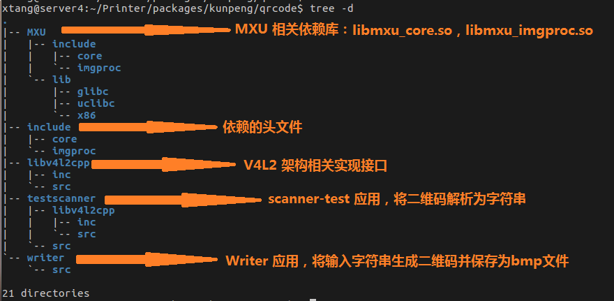

# qrcode二维码识别

##qrcode 简介
		近年来，随着移动互联网快速的发展，连带电子商务，物联网等多个热门领域的升温，二维码可以说是无孔不入的渗透进了我们的生活，并给人们的生活带来了巨大的便利。那么什么是二维码？二维码有什么优势？
		我们所说的QRCode(Quick Response Code)码，是由Denso公司于1994年9月研制的一种矩阵二维码符号，它具有一维条码及其它二维条码所具有的信息容量大、可靠性高、可表示汉字及图象多种文字信息、保密防伪性强等优点。
		君正qrcode 通过局部二制化的方式实现了一套完整的二维码编码解码流程，下面会分段介绍君正qrcode 代码结构，主要接口，编译及使用方式。
##代码路径及结构
* 代码路径：

		Printer/packages/kunpeng/qrcode

* 代码结构：

* 主要接口
	君正qrcode 的编码解码相关流程实现集成在了“libqrscanner.so” 库中，此库源码不开源，主要实现接口如下：

>void*    CreateQrCodeScanner();  $\color{red}{/*创建scanner对象*/}$

>int32_t  Decoder(void* scanner,uint8_t *ybuffer,int width,int height,int tryhard); $\color{red}{/*qrcode 解码，当前代码支持的输入数据是yuv中提取的y数据*/}$

>int32_t  GetResultString(void *scanner,char *result,int32_t max_size);  $\color{red}{/*获取qrcode 解析结果*/}$

>void     DestoryQrCodeScanner(void *scanner);  $\color{red}{/*销毁scanner对象*/}$

>int32_t CreateQrCodeBmp(const char*filename,char *text,int32_t size,int32_t margin,int32_t width,int32_t heigth,int32_t ecc);  $\color{red}{/*创建qrcode bmp格式文件*/}$
##编译方式
* 整体编译
	在相应的板级配置文件下添加"qrcode"模块名，之后整体编译:
	+ 文件:Printer/device/kunpeng/kunpeng_base.mk

			# cd Printer
			# source build/envsetup.sh
			# lunch
			<选择要编译的板级：kunpeng_usb-userdebug>
			# make

* 单独编译

			# cd Printer
			# make qrcode
			Note:
				如果当前shell 没有初始化过编译环境需要先初始化编译环境之后单独编译。
					# source build/envsetup.sh
					# lunch

* 生成目标
	a.目标路径：

		Printer/out/product/kunpeng/obj/packages/kunpeng/qrcode/qrcode

	b.目标文件：

			<目标路径>/libv4l2cpp/libv4l2wrapper.a
			<目标路径>/testscanner/scanner-test /*qrcode 应用*/
			<目标路径>/writer/writer

* 依赖库

			usr/lib/libmxu_core.so
			usr/lib/libmxu_imgproc.so
			usr/lib/libqrscanner.so
##qrcode 集成方式
	kunpeng 工程中已经将qrcode 集成在了qt的代码里，qtprinter服务中调用了scanner-test 程序实现qrcode主扫功能即解码功能，qtmain服务中调用了writer 程序实现了被扫功能即编码功能。

* 主扫功能
Printer/packages/kunpeng/testqt/qtprinter

 scanner-test 参数：

 		# scanner-test --help
		scanner-test camera need_result neet_yuv

		argv[1]:camera 设备节点：/dev/video1;
		argv[2]:是否支持qt服务主扫并解析qrcode功能,取值范围：0,1；
		argv[3]:是否支持qt服务被扫并生成qrcode功能，取值范围:0,1;

* 被扫功能
Printer/packages/kunpeng/testqt/qtmain

##使用方式
* 主扫操作

   	开发板上电启动后，点击屏幕上的**$\color{red}{主扫}$**按钮进入主扫界面，讲二维码放在camera 可取数据视野范围内，扫描成功后会在主扫按钮下方的文本框解析出二维码链接。

* 被扫操作
	点击屏幕上的**$\color{red}{被扫}$**按钮，点击**$\color{red}{产生}$**按钮，此时屏幕上生成一个二维码并将此二维码保存为"/tmp/a.bmp"，手机端扫描此二维码会直接跳转进入到君正官网。

