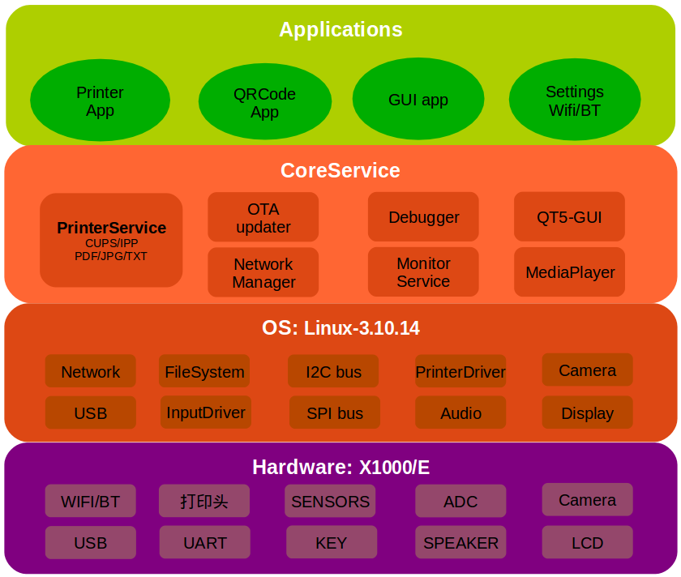

# 软件系统使用手册

## 软件架构介绍
Printer打印机软件工程代号kunpeng，主要包含如下模块：

* buildsystem： 采用君正Manhattan编译系统
* bootloader： u-boot
* OS： linux-3.10.14，便于利用linux系统丰富的软件包资源。
* buildroot: 主rootfs，包括基础库glibc,libcur,libjpeg,libqt5等。
* debug工具： debuggerd
* systemserver： systemMonitor，管理各进程的依赖关系，负责启动其它进程并监视进程运行情况，如果被监视进程发生异常重新启动此进程。
* OTA：OTA 网络升级服务
* NetworkManager：网络配置和网络监测服务。
* QRCode： 利用X1000 Camera接口实现二维码识别功能。
* 网络打印服务：采用CUPS网络打印服务
* 热敏打印头驱动：打印头模块步进电机的操控需要精准的实时性控制，利用X1000内置的小核CPU实现打印头实时控制。

### 软件框架图

