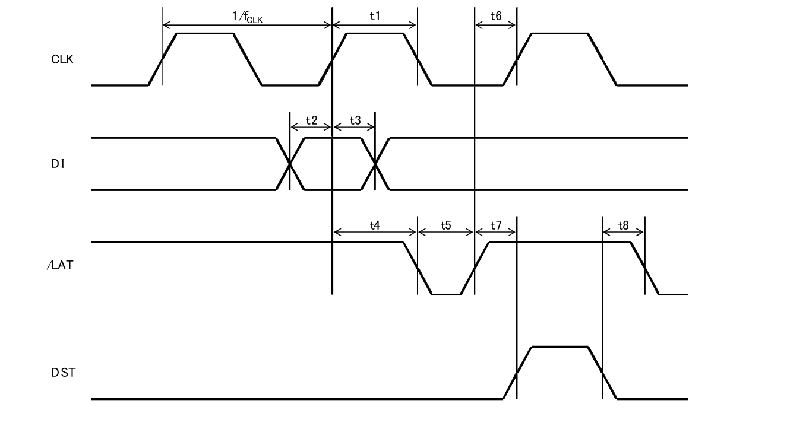

# 热敏打印头驱动

##1. 打印机系统框图


##2. 打印机控制

* 电机控制
* 打印头控制
* 加热控制
* 预测处理


####2.1 电机控制


```
如上图所示
1. 开始start step
2. 8步一个循环，每个循环走两行
3. 4步一行（纵向一个点）
```
---

```
电机的速度是靠修改Step Time来实现的，上面的表格是一个例子：
电机加速时，Step Time 减少
电机减速时，Step Time 增加
精细控制，每步按Step Time从表中查找
```
####2.2 打印头控制


```
将一行384个点对应的数据按顺序输入，拉低/LAT pin，把数据锁存到memory中，然后可以送入下一行数据，拉高DST到计算的加热时间，控制加热信号STB1、STB2、STB3、STB4、STB5、STB6，加热打印头，写入的数据中。对应二进制bit为1的点就会加热成黑点，对应二进制数据为0的bit则不会变色；与此同时，输入步进电机激励相序信号，转动一步（加热和步进电机转动同时进行）；紧接着输入第二行点的数据……，依次循环24次（24*24字体），完成一整行字符、汉字打印。
```
####2.3 加热控制


```
DST高电瓶是加热，上图是3段加热的理智，当电机第一步时开始加热，并且电机周期（W）要大于加热时间（t）加500us
```

```
48个黑点（actived dot）最大电流3.15A，我们是4A电源，所以最大每次加热点为48.
```
####2.4 预测算法
```
* 电机的速度由加热时间和温度决定
* 电机加减速时，每次最大加减一个单位（防止卡纸）
* 预测目标为达到最大速度
```
这样需要对每行数据提前预测，并且当减速时需要回归预测结果，使得减速不能越速。
```
减速预测：1,2,3,4,5 是速度
1     2    3    4    5    1
5到1越速了回归：
1     2    3    3    2    1 

加速预测：
1     2    3    3    2    1    4
1到4越速了回归：
1     2    3    3    2    1    2 
```
##3.  打印头控制代码
####3.1 打印控制时序图


####3.2流程简介
PDMA MCU代码和数据段只有8K，若装载所有数据及代码会导致空间不够使用，把代码分成两个部分，记初始化部分和实时逻辑控制部分。
为保证代码独立采用单独的一个firmware.

* mcu装载
* 使用的设备初始化
* 预测数据
* 数据通讯
```
mcu里实时要求比较高的是电机控制部分，这部分采用中断的方法来实现，其他部分采用的是查询的办法。
把所有控制都看成是事件来处理
```
* timer7 是电机控制
* timer6 是加热控制
* timer4 是数据通讯
```
主cpu产生timer4中断给mcu，mcu收到中断后向主cpu请求数据，mcu接收到数据后通过spi给打印头传输，同时电机开始运行，当电机第一步发生后，判断数据是否完成，然后启动加热，同时把下一帧数据发送给打印头。
```
 
##4. 打印机驱动简介
 
 热敏小票打印机是一种常见的打印机设备，通常基于单片机来控制打印头来实现打印功能。　君正的X1000E芯片是针对物联网领域的一款芯片，针对热敏打印机市场，君正开发了一套基于君正芯片的打印机驱动。 X1000E芯片有两个cpu核心， 分为大小核，即cpu（大核）和mcu（小核）。 cpu负责准备和传输数据， mcu负责打印。双核协作来共同完成打印任务。
 
####4.1 代码结构：
 大体分为两部分，mcu代码和内核部分代码，mcu代码下载位置： git clone ssh://192.168.1.26:29418/Manhattan/firmware/mcu_firmware.git -b kunpeng
 
####4.2 目录结构：
   
   
   主要目录简介：
   
目录 | 内容
- | -
doc | 打印机相关文档
include | 相关头文件
kernel|内核打印机驱动，编译可生成jz_printer.ko
loader|uboot使用的loader，用于在u-boot里调试mcu的功能
LP01245|LP01_245热敏打印头的驱动，结构与src目录一样
src|LP02_245热敏打印头的驱动，结构与LP01_245目录一样
u-boot|uboot环境，用于在u-boot里调试mcu的功能
a.sh|编译脚本
   
    
####4.3  修改编译驱动时kernel依赖路径：
 
* 编译内核驱动时，需要指定内核所在的目录位置，如：修改mcu_firmware/kernel/driver/char/printer/Makefile中设置
KERNELDIR:=/home/jgao/kp1/out/product/kunpeng/obj/kernel-intermediate

见下图：
 
 
 编译mcu固件，生成jz_printer.img
 
```
修改完毕后，在mcu_firmware目录执行./a.sh脚本生成的loader/loader.bin就是jz_printer.img
```

编译内核打印机驱动模块，生成jz_printer.ko
```
cd mcu_firmware/kernel/driver/char/printer;make 
生成jz_printer.img和jz_printer.ko
```

编译完成后，将jz_printer.img拷贝到板子/lib/firmware/目录下，将jz_printer.ko拷贝到板子中，在板子上执行：insmod /jz_printer.ko， 就可以挂载打印机驱动。

##5. 打印机驱动常用修改
####5.1 GPIO修改
打开src/printer.h文件，对照原理图，修改打印头gpio相关配置：
 
 
####5.2 打印参数修改
打开src/host_to_mcu.h文件，修改打印头宽度，最大加热点数等参数：
 
 