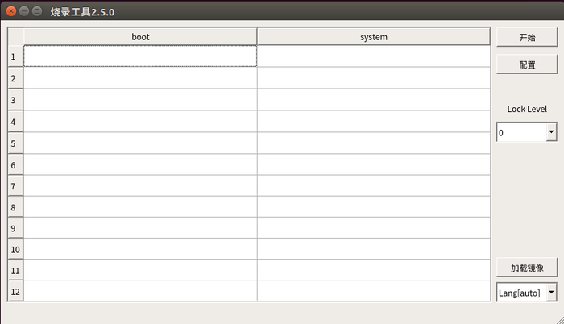
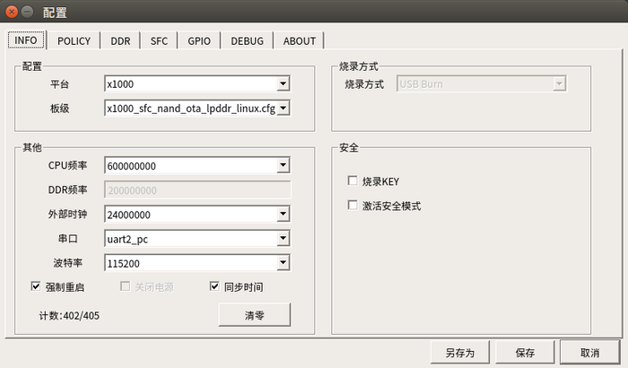
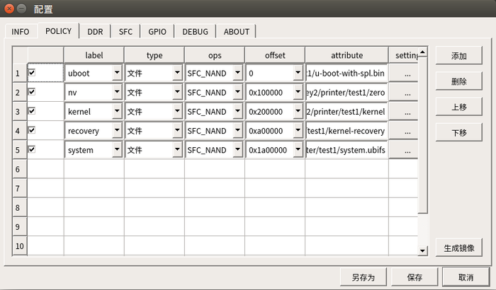
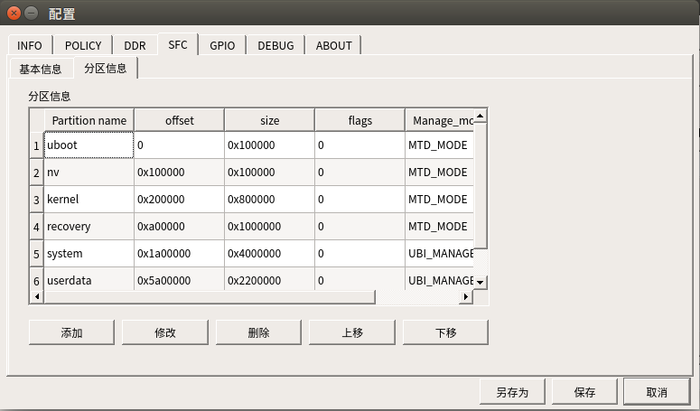

# usb烧录工具


当前内容是针对从spi nand 启动的编译说明,烧录工具存放于工程prebuilts/burnertools目录下,分别有windows和ubuntu版本,请根据自己的环境选择相应的烧录工具
* 注1：本说明文档在linux 环境下编写
* 注2：烧录工具的详细说明请参考烧录工具的使用说明文档


* 编译

```
参考 doc下的文档进行编译，在out/product/j618/image目录下得到如下镜像
kernel，kernel-recovery，system.ubifs，u-boot-with-spl.bin，zero

```

### 烧录工具使用方法
1.解压烧录工具软件包，并将工程中prebuilts/burnertools/x1000_sfc_nand_kunpeng_ota_lpddr_linux.cfg拷贝到烧录工具configs/x1000目录。进入烧录工具目录，执行sudo  ./cloner启动烧录工具，如下界面显示：(图1)



2.点击[配置]选项，打开配置界面，如下界面所示：(图2)



其中选项按此界面配置即可，平台和板级选择如下：

    * printer halley2 平台选x1000，板级选 x1000_sfc_nand_kunpeng_ota_lpddr_linux.cfg
    * printer pear 平台选x1000，板级选 x1000_sfc_nand_kunpeng_ota_lpddr_linux.cfg

3.点击[POLICY] 选项，进行烧录文件的配置，界面如下所示：



点击[setting]进行烧录文件的路径选择，分别选中工程编译出的镜像
uboot : u-boot-with-spl.bin
nv : zero
kernel : uImage
recovery : kerney-recovery
system : system.ubifs
完成上述操作后，点击[保存]，返回（图1）所示界面。

4.若对分区有改的需求则在[配置]界面下，点击进入[SFC]界面（如果没有特殊需求，直接使用默认的配置文件即可）



此界面下点击[添加],[修改],[删除],[上移],[下移]按键对分区进行添加、修改、删除、上移、下移排序等操作

* 调整完分区后,点击[保存]，返回到（图1）界面。
**注意如果分区有改动，记得检查、修改[POLICY]中镜像的烧录偏移与分区的起始位置保持一致**。

5.开始烧录
点击(图1)界面 [开始]按键，使烧录工具处于待烧录状态。
此时，启动开发板进入USB BOOT模式，开始烧录。

详细的使用说明可以参考[USBCloner-Guide.pdf](USBCloner-Guide.pdf)

### 开发板如何进入 USB BOOT 烧录模式

* halley2开发板

按住BOOT键，按下RESET重启，开发板会进入USB BOOT模式，即烧录模式。

